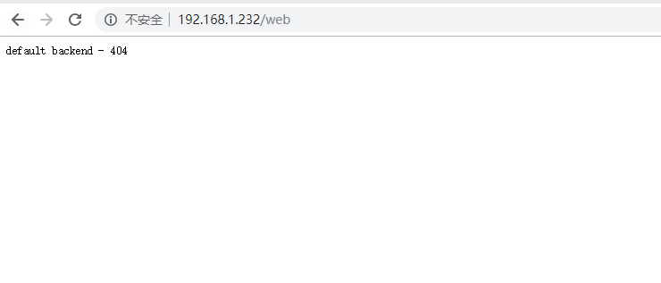

# ingress-nginx 整理

### 一. Ingress-nginx 基础

官网 https://github.com/kubernetes/ingress-nginx

最新release [NGINX: 0.21.0](https://github.com/kubernetes/ingress-nginx/releases/tag/nginx-0.21.0)    https://github.com/kubernetes/ingress-nginx/archive/nginx-0.20.0.tar.gz

```
Image: quay.io/kubernetes-ingress-controller/nginx-ingress-controller:0.21.0
```

*New Features:*

- NGINX 1.15.6 with fixes for vulnerabilities in HTTP/2 ([CVE-2018-16843](http://cve.mitre.org/cgi-bin/cvename.cgi?name=CVE-2018-16843), [CVE-2018-16844](http://cve.mitre.org/cgi-bin/cvename.cgi?name=CVE-2018-16844))
- Support for TLSv1.3. Disabled by default. Use [ssl-protocols](https://kubernetes.github.io/ingress-nginx/user-guide/nginx-configuration/configmap/#ssl-protocols) `ssl-protocols: TLSv1.3 TLSv1.2`
- New annotation for [canary deployments](https://kubernetes.github.io/ingress-nginx/user-guide/nginx-configuration/annotations/#canary)
- Support for configuration snippets when the authentication annotation is used
- Support for custom ModSecurity configuration
- LUA upstream configuration for TCP and UDP services


### 二.helm 安装

```
kubectl apply -f https://raw.githubusercontent.com/kubernetes/ingress-nginx/master/deploy/mandatory.yaml

# k8s.gcr.io/defaultbackend:1.4
# 这个镜像永远返回404错误的http服务进程(/healthz除外)
docker pull gcr.io/google-containers/defaultbackend:1.4

```

```
helm install --name nginx-ingress --set "controller.service.externalIPs[0]=192.168.1.232" ./nginx-ingress

helm install --name nginx-ingress --set "controller.service.externalIPs[0]=192.168.1.232" stable/nginx-ingress
```

浏览器访问 http://192.168.1.232/healthz



其他路径都会报 default backend - 404

